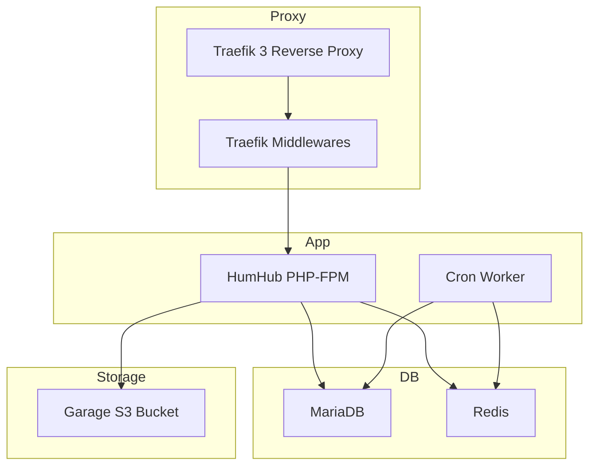

# HumHub Docker Deployment (IPv4/IPv6 Ready)

A production‑ready HumHub installation using Docker Compose, including Traefik 3, MariaDB, Redis, Cron, S3-compatible storage, installation automation, and full IPv4/IPv6 support.

## Contents
- Overview
- Architecture Diagram
- Features
- Requirements
- Installation
- Initial Startup
- Configuration
- IPv6 Notes
- Services
- Data Persistence
- Updates
- Troubleshooting

## Overview
This repository provides a fully containerized HumHub environment optimized for performance, stability, and maintainability.  
It includes a system preparation script that generates necessary folders, permissions, `.env`, and the automated `installation_config.php` used during first‑time setup.

## Architecture Diagram


## Features
- Production-grade Docker Compose architecture
- Traefik **3.6** reverse proxy with automatic Let’s Encrypt certificates
- Full support for IPv4 and IPv6 environments
- Automated `installation_config.php` generation
- Automated `.env` management
- Optional S3 storage using Garage
- Dedicated cron worker for background jobs
- Clean directory layout under `/local/humhub`
- Optional future support for MariaDB Galera clustering

## Requirements
- Linux host (Ubuntu, Debian, AlmaLinux, Rocky, etc.)
- Docker Engine + Docker Compose v2
- Open ports: **80** and **443** (IPv4 + IPv6)
- DNS A (IPv4) and/or AAAA (IPv6) records
- Non‑root user `humhub` with Docker group access

## Installation

### 1) Clone the repository
```bash
git clone https://github.com/martdj/HumHub.git
cd HumHub
```

### 2) Prepare the host
Run the automated setup:

```bash
sudo ./prepare_system.sh
```

This will:

- Create `/local/humhub/*` directories  
- Fix permissions  
- Generate `.env`  
- Generate `installation_config.php`  
- Install required host dependencies  
- Validate firewall IPv4/IPv6 accessibility  
- Prepare the `humhub` user  

### 3) Start services needed for installation  
**Initial startup now includes:**

- **MariaDB**
- **Redis**
- **HumHub**
- **Traefik**
- **Traefik Middlewares**

Start everything required for the first login:

```bash
sudo -u humhub docker compose up -d mariadb redis humhub traefik traefik-middlewares
```

Once HumHub is initialized, open your domain in the browser.

Login using the values generated in your `.env`:
- **Admin username**
- **Admin password**

### 4) Start Cron after installation
```bash
sudo -u humhub docker compose up -d humhub-cron
```

## Configuration

### Important files
- `.env`
- `docker-compose.yml`
- `data/humhub/config/installation_config.php`

### Environment variables
Your `.env` contains:
- Admin credentials  
- Mail settings  
- Database credentials  
- Traefik domain  
- S3 settings (optional)  
- Timezone  

## IPv6 Notes
This deployment supports:
- Dual‑stack IPv4/IPv6
- Traefik host‑mode IPv6 binding
- Automatic certificate issuance over IPv6
- Pure IPv6 setups if desired

Make sure:
- AAAA record exists
- Your hosting provider supports native IPv6
- Firewall allows inbound v6 on ports 80/443

## Services

| Service | Purpose | Ports |
|--------|---------|-------|
| Traefik | Reverse proxy & TLS | 80/443 |
| Traefik‑middlewares | Redirects, security, headers | internal |
| HumHub | PHP-FPM app | via Traefik |
| MariaDB | Database | internal |
| Redis | Cache | internal |
| Cron | Worker for background tasks | internal |
| Garage | Optional S3 storage | internal/external |

## Data Persistence
All persistent data lives in:

```
/local/humhub/humhub
/local/humhub/db
/local/humhub/redis
/local/humhub/garage
/local/humhub/traefik
```

## Updating

### Update all containers
```bash
sudo -u humhub docker compose pull
sudo -u humhub docker compose up -d
```

### OS updates
Use your distribution’s package manager.

## Troubleshooting

### 502 / 504 Gateway errors
Check HumHub logs:
```bash
docker compose logs humhub
```

### Installation login fails
- Verify `.env` admin credentials
- Verify `installation_config.php`

### Cron not running
```bash
docker compose logs humhub-cron
```

### IPv6 unreachable
- Verify AAAA DNS record
- Check firewall inbound IPv6 rules
- Validate provider IPv6 support

---

This deployment is stable, maintainable, and ready for real-world production use.
``
