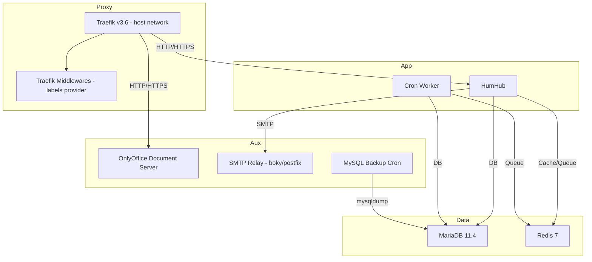

# HumHub Docker Deployment (IPv4/IPv6 Ready, Traefik v3.6)

A production‑ready HumHub deployment using Docker Compose with Traefik 3.6 (host network, IPv6‑first), MariaDB, Redis, OnlyOffice Document Server, SMTP relay, scheduled backups, and a dedicated Cron worker.  

---

## Table of Contents
- Overview
- Architecture Diagram
- Requirements
- Directory Layout & Persistence
- Environment Variables (`.env`)
- Installation & Initial Startup
- Services & Endpoints
- Traefik & Middlewares
- Health Checks
- Backups & Restore
- IPv6 Notes
- Operations (Update/Logs/Stop)
- Troubleshooting

---

## Overview
This stack exposes HumHub securely through Traefik v3.6 with automatic certificates (ACME HTTP‑01).  
Middlewares (redirect, compression, security headers) are declared in a separate `traefik-middlewares` service and referenced by the app routers.  
The reverse proxy binds to `:80`/`:443` on **IPv6** (`[::]`) and supports dual‑stack (IPv4/IPv6) when available.

---

## Architecture Diagram


---

## Requirements
- Linux host (Ubuntu/Debian/Alma/Rocky, etc.)
- Docker Engine + Docker Compose v2
- Open inbound ports **80** and **443** (IPv4 and/or IPv6)
- Public DNS for:
  - `HUMHUB_HOST` (HumHub)
  - `ONLYOFFICE_HOST` (OnlyOffice)
- A `.env` file with required variables (see below)

---

## Directory Layout & Persistence
Host bind mounts (all under `/local/humhub/data`):

```
/local/humhub/data/
  db-data/                 # MariaDB data
  humhub/
    config/                # HumHub protected config
    uploads/               # User uploads
    modules/               # Additional HumHub modules
    logs/                  # Runtime logs
    themes/                # Custom themes
  onlyoffice/
    data/                  # OnlyOffice data
    log/                   # OnlyOffice logs
  backups/                 # Database backups (from backup container)
  traefik/
    letsencrypt/           # ACME storage (acme.json)
  redis/                   # Redis AOF data
```

Create these (if not using an external script):
```bash
sudo mkdir -p \
  /local/humhub/data/db-data \
  /local/humhub/data/humhub/{config,uploads,modules,logs,themes} \
  /local/humhub/data/onlyoffice/{data,log} \
  /local/humhub/data/backups \
  /local/humhub/data/traefik/letsencrypt \
  /local/humhub/data/redis

# (Optional) Restrict ACME storage as recommended
sudo touch /local/humhub/data/traefik/letsencrypt/acme.json
sudo chmod 600 /local/humhub/data/traefik/letsencrypt/acme.json
```

---

## Environment Variables (`.env`)
Populate a `.env` alongside your `docker-compose.yml`:

```bash
# General
TZ=Europe/Amsterdam
LE_EMAIL=admin@example.com

# HumHub app
HUMHUB_VERSION=1.16.0
HUMHUB_HOST=humhub.example.com
HUMHUB_BASE_URL=https://humhub.example.com
HUMHUB_ADMIN_USERNAME=admin
HUMHUB_ADMIN_EMAIL=admin@example.com
HUMHUB_ADMIN_PASSWORD=ChangeMe_Secret123
NGINX_CLIENT_MAX_BODY_SIZE=128m
NGINX_KEEPALIVE_TIMEOUT=65

# MariaDB
MARIADB_ROOT_PASSWORD=ChangeMe_RootSecret123
MARIADB_DATABASE=humhub
MARIADB_USER=humhub
MARIADB_PASSWORD=ChangeMe_DbSecret123

# Redis
REDIS_PASSWORD=ChangeMe_RedisSecret123

# OnlyOffice
ONLYOFFICE_VERSION=8.1.1
ONLYOFFICE_JWT_SECRET=ChangeMe_OnlyOfficeJWT
ONLYOFFICE_HOST=onlyoffice.example.com

# SMTP relay (boky/postfix)
SMTP_RELAY_HOST=smtp.relay.example.com
SMTP_RELAY_PORT=587
SMTP_RELAY_USER=apikey
SMTP_RELAY_PASSWORD=ChangeMe_SmtpSecret123
SMTP_HELO_NAME=mail.example.com

# Backups
BACKUP_SCHEDULE=0 3 * * *   # daily 03:00
```

> Note: In the provided compose, `ALLOWED_SENDER_DOMAINS` is set to `martdj.nl` directly on the `smtp` service. Adjust in the compose if needed.

---

## Installation & Initial Startup

1) **Clone (or place) the compose files**  
Make sure `.env` and `docker-compose.yml` sit in the same directory.

2) **Start the services required for first‑time setup**  
Initial startup must include **Traefik** and **Traefik‑middlewares** (so routes and middlewares resolve), plus HumHub’s dependencies:

```bash
# From the compose directory:
docker compose up -d mariadb redis humhub traefik traefik-middlewares
```

3) **Obtain certificates automatically**  
Traefik will issue certificates via HTTP‑01 once DNS resolves to your host and ports 80/443 are reachable.

4) **Access HumHub**  
Open `https://$HUMHUB_HOST`.  
The container is configured for auto‑install using the admin credentials from `.env`.

5) **Start the Cron worker after successful install**  
```bash
docker compose up -d humhub-cron
```

6) **Start auxiliary services (optional but recommended)**  
```bash
# Document editing
docker compose up -d onlyoffice

# Outbound mail relay
docker compose up -d smtp

# Scheduled DB backups
docker compose up -d backup
```

---

## Services & Endpoints

| Service             | Role                               | Exposure                          |
|---------------------|------------------------------------|-----------------------------------|
| `traefik`           | Reverse proxy, ACME                | Host network `:80`, `:443`        |
| `traefik-middlewares` | Declares middlewares via labels | Internal (labels read by Traefik) |
| `humhub`            | Main web application               | via Traefik (`HUMHUB_HOST`)       |
| `humhub-cron`       | Queue + cron runner                | internal                          |
| `mariadb`           | Database                           | internal                          |
| `redis`             | Cache / queue backend              | internal                          |
| `onlyoffice`        | Document server                    | via Traefik (`ONLYOFFICE_HOST`)   |
| `smtp`              | SMTP relay (boky/postfix)          | internal                          |
| `backup`            | mysqldump via cron                 | internal                          |

**Networks**
- `proxy`: for fronted services (`humhub`, `onlyoffice`, `traefik-middlewares`)
- `app-net`: internal app/data traffic

---

## Traefik & Middlewares

**Traefik (v3.6)**
- `network_mode: host`  
- EntryPoints:
  - `web` → `[::]:80`
  - `websecure` → `[::]:443`
- ACME (HTTP‑01):  
  - `--certificatesresolvers.letsencrypt.acme.email=${LE_EMAIL}`  
  - `--certificatesresolvers.letsencrypt.acme.storage=/letsencrypt/acme.json`  
  - `--certificatesresolvers.letsencrypt.acme.httpChallenge.entryPoint=web`

**Middlewares (declared on `traefik-middlewares` via labels)**
- `redirect-to-https`: redirects HTTP → HTTPS
- `compress`: enables on‑the‑fly compression
- `security-headers`: HSTS, no‑sniff, XSS filter, frame deny, etc.

**Routers**
- `humhub`:
  - `rule=Host(${HUMHUB_HOST})`, entrypoint `websecure`, TLS via `letsencrypt`
  - middlewares: `security-headers,compress`
- `onlyoffice`:
  - HTTP router on `web` with `redirect-to-https`
  - HTTPS router on `websecure` with `security-headers,compress`

> If you see “middleware does not exist”, ensure `traefik-middlewares` is **running** before starting services that reference those middlewares.

---

## Health Checks

- **humhub**: `curl -f http://localhost/ping`  
- **onlyoffice**: `curl -fsS http://localhost/healthcheck`  
- **redis**: `redis-cli -a $REDIS_PASSWORD ping`

Check logs if a healthcheck fails:
```bash
docker compose logs humhub
docker compose logs onlyoffice
docker compose logs redis
```

---

## Backups & Restore

**Backups**
- The `backup` service runs `mysqldump` on the schedule set by `BACKUP_SCHEDULE`.
- Dumps are stored in `/local/humhub/data/backups` on the host.

**Restore (example)**
```bash
# Stop HumHub to avoid writes during restore
docker compose stop humhub humhub-cron

# Restore the latest dump (replace filename as needed)
gunzip -c /local/humhub/data/backups/your_dump.sql.gz | \
  docker compose exec -T mariadb \
  sh -c 'mysql -u"$MARIADB_USER" -p"$MARIADB_PASSWORD" "$MARIADB_DATABASE"'

# Start services back
docker compose up -d humhub humhub-cron
```

---

## IPv6 Notes
- Traefik binds to IPv6 (`[::]`) for both `web` and `websecure`. Dual‑stack hosts will also serve IPv4.
- Ensure your DNS has an **AAAA** record for each hostname.
- Open firewall for IPv6 ports **80/443**.
- If you run **IPv6‑only**, confirm your provider and upstream paths support it.

---

## Operations

**Update containers**
```bash
docker compose pull
docker compose up -d
```

**View logs**
```bash
docker compose logs -f traefik
docker compose logs -f humhub
docker compose logs -f onlyoffice
```

**Stop / Start**
```bash
docker compose stop
docker compose up -d
```

**Validate compose**
```bash
docker compose config
```

---

## Troubleshooting

**Middlewares not found**
- Start `traefik` and `traefik-middlewares` **first**:
  ```bash
  docker compose up -d traefik traefik-middlewares
  ```
- Then (re)start apps referencing them.

**502/504 from Traefik**
- Check app health/logs:
  ```bash
  docker compose ps
  docker compose logs humhub
  ```
- Verify DNS resolves to the correct IP and ports are reachable.

**Cannot obtain TLS certificates**
- Verify A/AAAA DNS records, 80/443 open, and no extra proxy interfering.
- Check Traefik logs:
  ```bash
  docker compose logs traefik
  ```

**OnlyOffice not reachable**
- Ensure `onlyoffice` is started and DNS for `ONLYOFFICE_HOST` points to your server.
- Check health:
  ```bash
  docker compose logs onlyoffice
  ```

**HumHub queue/cron tasks not running**
- Start the cron worker:
  ```bash
  docker compose up -d humhub-cron
  ```

---

Ready for production. Keep your `.env` secrets secure and consider restricting access to the ACME storage (`acme.json`) as shown above.
