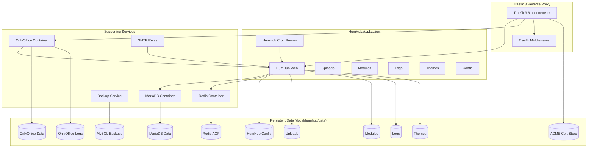

# HumHub Docker Deployment (with OnlyOffice & Traefik 3)

A complete, production‑ready Docker environment for deploying **HumHub**, including:

- Traefik 3 reverse proxy with automatic HTTPS (Let's Encrypt)  
- MariaDB  
- Redis (cache + queue)  
- OnlyOffice DocumentServer  
- SMTP relay  
- Automated MySQL backups  
- Dedicated Cron/Queue container  
- Automated host preparation script  
- Installation checker  
- IPv6‑ready and reproducible deployment workflow  

---

## Architecture Overview



---

## Features

### Automated Host Preparation

`prepare_system.sh` handles:

- Installation of Docker CE & dependencies  
- SELinux and firewalld configuration  
- Creation of all persistent directories under `/local/humhub/data`  
- Automatic `.env` generation with secure defaults  
- Generation of `installation_config.php`  
- Adding the `humhub` user to the `docker` group  
- ACME staging/production toggle in compose  
- Downloading the installation checker  

### Clean Installation Flow

1. Start minimal stack: Traefik + MariaDB + Redis + HumHub  
2. Let HumHub perform migrations  
3. Log in as admin  
4. Start full stack: Cron, OnlyOffice, SMTP, Backups, Middlewares  

This avoids migration‑time race conditions.

### Persistent Data Layout

```
/local/humhub/data/
  db-data/              # MariaDB
  humhub/
    config/             # installation_config.php + configuration
    uploads/            # user uploaded content
    modules/            # installed modules
    logs/               # application logs
    themes/             # custom themes
  onlyoffice/
    data/               # persistent file storage
    log/                # logs
  redis/                # AOF persistence
  traefik/letsencrypt/  # ACME certificates
  backups/              # database backups
```

HumHub search index is intentionally *not* persisted.

---

# Installation Guide

## 1. Prepare the host

Run:

```bash
chmod +x prepare_system.sh
./prepare_system.sh
```

This sets up Docker, directory structure, `.env`, configuration files, and permissions.

---

## 2. Validate with installation checker

```bash
./humhub-install-check.sh
```

Ensures:

- Database directory is empty  
- Config directory only contains `installation_config.php`  
- The `humhub` user can use Docker  
- No remnants of previous installs  

---

## 3. Start minimal stack for installation

```bash
sudo -u humhub docker compose up -d traefik mariadb redis humhub
sudo -u humhub docker compose logs -f humhub
```

Wait for:

```
Migrated up successfully.
Installation complete.
```

---

## 4. Log into HumHub

Open:

```
https://<HUMHUB_HOST>/
```

Login using the admin credentials chosen during preparation.

---

## 5. Start full production stack

```bash
sudo -u humhub docker compose up -d
```

Starts:

- OnlyOffice  
- Cron runner  
- Backup container  
- SMTP relay  
- Static Traefik middlewares  

---

# Updating

```bash
sudo -u humhub docker compose pull
sudo -u humhub docker compose up -d
```

To update config:

```bash
./prepare_system.sh
```

---

# Directory Structure Overview

```
/local/humhub
  prepare_system.sh
  humhub-install-check.sh
  docker-compose.yml
  .env
  data/
    db-data/
    humhub/
      config/
      uploads/
      modules/
      logs/
      themes/
    onlyoffice/
      data/
      log/
    redis/
    traefik/
    backups/
```

---

# Best Practices

- Always run `docker compose` as the **humhub** user  
- Keep `acme.json` mode `600`  
- Ensure DNS records exist before starting Traefik  
- Do not persist HumHub’s search index  
- Prefer pinned Traefik version (`traefik:v3.6`)  

---

# License

This repository provides orchestration scripts; HumHub, Traefik, Redis, MariaDB, and OnlyOffice retain their upstream licenses.
