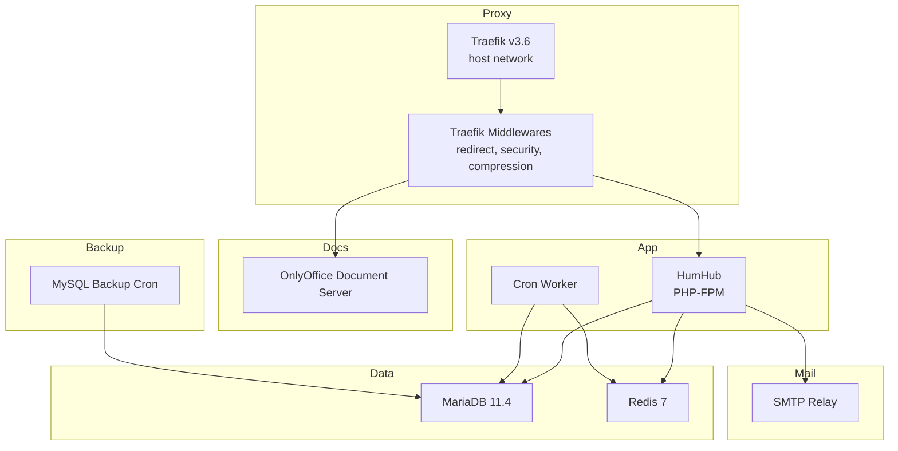

# HumHub Docker Deployment (Production‑Ready with Traefik 3.6)

A robust, production‑ready HumHub deployment using Docker Compose.  
Includes Traefik 3.6, MariaDB 11.4, Redis 7, OnlyOffice Document Server, SMTP relay, automated backups, and a dedicated Cron worker.  
A powerful interactive installer (`prepare_system.sh`) fully automates host preparation, directory creation, environment configuration, and HumHub bootstrapping.

---

## Table of Contents
- Overview
- Architecture Diagram
- Components
- Requirements
- Directory Layout
- Installation Tools
  - prepare_system.sh
  - Installation Config Generator
  - Environment Wizard
  - Firewall & Dependency Checks
  - Installation Checker
- Quick Install
- Full Installation Walkthrough
- Services
- Updating & Maintenance
- Backup & Restore
- IPv6 Notes
- Scaling & Extensions (Garage S3, HA Considerations)
- Troubleshooting

---

## Overview

This repository provides a fully containerized HumHub environment optimized for performance, reliability, IPv4/IPv6 compatibility, and ease of installation.  
The included `prepare_system.sh` script automates nearly every step of host preparation, making first‑time installation straightforward for beginners and experts alike.

---

## Architecture Diagram



---

## Components

| Component | Purpose |
|----------|---------|
| **Traefik 3.6** | Reverse proxy, certificates, security headers |
| **HumHub** | Main application container |
| **HumHub Cron** | Queue runner + scheduled tasks |
| **MariaDB 11.4** | Database |
| **Redis 7** | Cache + Queue backend |
| **OnlyOffice Document Server** | In‑browser document editing |
| **Postfix SMTP Relay** | Outbound email |
| **MySQL Backup Container** | Automated scheduled backups |

---

## Requirements

- A Linux host (Ubuntu, Debian, AlmaLinux, Rocky, etc.)
- Docker Engine & Docker Compose V2
- Open inbound ports **80** and **443** (IPv4 and/or IPv6)
- Public DNS for:
  - HumHub (`HUMHUB_HOST`)
  - OnlyOffice (`ONLYOFFICE_HOST`)
- A user account with sudo rights

---

## Directory Layout

All persistent data lives under `/local/humhub/data`:

```
/local/humhub/data/
  db-data/
  humhub/
    config/
    uploads/
    modules/
    logs/
    themes/
  onlyoffice/
    data/
    log/
  redis/
  backups/
  traefik/
    letsencrypt/
```

---

## Installation Tools

### `prepare_system.sh` (interactive installer)

This script automates:

- Directory creation for all bind‑mounts  
- Permission configuration  
- Installation of system packages (curl, jq, tar, firewall tooling, Docker if needed)  
- Docker & Docker Compose verification  
- Automatic `.env` creation using an interactive wizard  
- Pre‑filling defaults by reading an existing `.env`  
- Validation of ports (IPv4 + IPv6 reachability)  
- Firewall checks for 80/443  
- Installation of cron job for backups  
- User setup:  
  - Adds the `humhub` user if needed  
  - Grants membership in the `docker` group  
- Creation of `installation_config.php` for auto‑install  
- Optional toggle for Let's Encrypt staging environment  
- Installation checker (validates all required tools before running the stack)

This script is **always interactive**—no non‑interactive mode is provided.

### Installation Config Generator

Generates:

```
/local/humhub/data/humhub/config/installation_config.php
```

Used by the HumHub container to auto‑install the platform with the admin account from `.env`.

### Environment File Wizard

Prompts for:

- Domain names  
- Admin credentials  
- Mail settings  
- Database settings  
- Redis password  
- OnlyOffice host + JWT secret  
- Backup schedule  
- Timezone  

Automatically loads defaults from `.env` when present.

### Firewall & Dependency Checker

Ensures:

- Host can bind to ports 80/443  
- DNS resolves correctly  
- IPv6 is available when applicable  
- Required binaries exist:
  - docker
  - docker compose
  - curl
  - openssl
  - jq
  - tar

### Installation Checker

Confirms:

- Directory structure exists  
- Permissions are correct  
- Required environment variables are set  
- docker-compose.yml is syntactically valid  

---

## Quick Install

You can bootstrap the server instantly using:

```bash
curl -fsSL https://raw.githubusercontent.com/martdj/Humhub/refs/heads/main/prepare_system.sh | sudo bash
```

This:

1. Downloads the latest installer  
2. Runs it as root  
3. Launches the interactive setup wizard  
4. Creates `.env`, config directories, and installation config  
5. Prepares the machine for container startup  

---

## Full Installation Walkthrough

### 1. Run the installer
```bash
sudo ./prepare_system.sh
```

### 2. Start all services needed for installation
To allow middleware references and TLS issuance:

```bash
docker compose up -d mariadb redis humhub traefik traefik-middlewares
```

### 3. Access HumHub
Navigate to:

```
https://<HUMHUB_HOST>
```

Login using:

- admin username (from `.env`)
- admin password (from `.env`)

### 4. Start background services

```bash
docker compose up -d humhub-cron onlyoffice smtp backup
```

---

## Services

| Service | Port / Access | Purpose |
|---------|----------------|---------|
| **traefik** | Host‑mode 80/443 | HTTPS termination, routing |
| **traefik-middlewares** | Internal | Provides redirect/security/compression middlewares |
| **humhub** | via Traefik | Main application |
| **humhub-cron** | internal | Cron + queue worker |
| **mariadb** | internal | Database |
| **redis** | internal | Cache + queue backend |
| **onlyoffice** | via Traefik | Document editing |
| **smtp** | internal | Email relay |
| **backup** | internal | mysqldump backups |

---

## Updating & Maintenance

### Update all containers

```bash
docker compose pull
docker compose up -d
```

### Validate configuration

```bash
docker compose config
```

### View logs

```bash
docker compose logs -f humhub
docker compose logs -f traefik
docker compose logs -f onlyoffice
```

---

## Backup & Restore

### Backups
Produced automatically by the `backup` container:

```
/local/humhub/data/backups/*.sql.gz
```

### Restore example

```bash
docker compose stop humhub humhub-cron

gunzip -c backupfile.sql.gz | \
  docker compose exec -T mariadb \
  sh -c 'mysql -u"$MARIADB_USER" -p"$MARIADB_PASSWORD" "$MARIADB_DATABASE"'

docker compose up -d humhub humhub-cron
```

---

## IPv6 Notes

This deployment:

- Binds Traefik to IPv6 (`[::]:80`/`[::]:443`)
- Works fully dual‑stack  
- Supports IPv6‑only setups if DNS + provider allow it  

Ensure:

- AAAA record exists  
- Firewall allows inbound IPv6  
- ISP/router supports next‑hop IPv6  
- No NAT66 or misconfigured reverse proxy sits in front

---

## Scaling & Extensions

This stack runs as a **single‑node deployment**, ideal for small to medium communities.

### Horizontal scaling (future option)

You may scale:

- HumHub containers  
- Cron workers  
- OnlyOffice

Requires:

- Moving to Docker Swarm or Kubernetes  
- Shared storage for:
  - uploads  
  - modules  
  - themes  
  - config  

### Using Garage S3 (optional)

To offload uploads & backups, you can extend the stack with:

- A Garage S3 cluster for:
  - Upload storage
  - Backups
  - External off‑site replication

This requires:

- Adding a `garage` service
- Configuring HumHub’s S3 storage backend
- Switching volumes → S3 buckets

A Garage‑based setup is recommended when:

- Running multiple HumHub frontends  
- Storing large media libraries  
- Requiring geo‑replicated object storage  

---

## Troubleshooting

### Middlewares not found
Start Traefik + middlewares first:

```bash
docker compose up -d traefik traefik-middlewares
```

### TLS certificates not generating
Check:

```bash
docker compose logs traefik
```

Ensure:

- Port 80/443 exposed  
- DNS A/AAAA correct  
- No extra proxy interfering  

### OnlyOffice connection errors
Verify:

```bash
docker compose logs onlyoffice
```

Check that:

- JWT secret matches HumHub  
- ONLYOFFICE_HOST is correct  
- The server is reachable via Traefik  

### Cron jobs not running
The cron worker must be started:

```bash
docker compose up -d humhub-cron
```

### Database errors
Inspect logs:

```bash
docker compose logs mariadb
```

---

Ready for production!  
This setup balances robustness, maintainability, and simplicity—while leaving room for future scaling such as object storage via Garage or multi‑node expansion.
